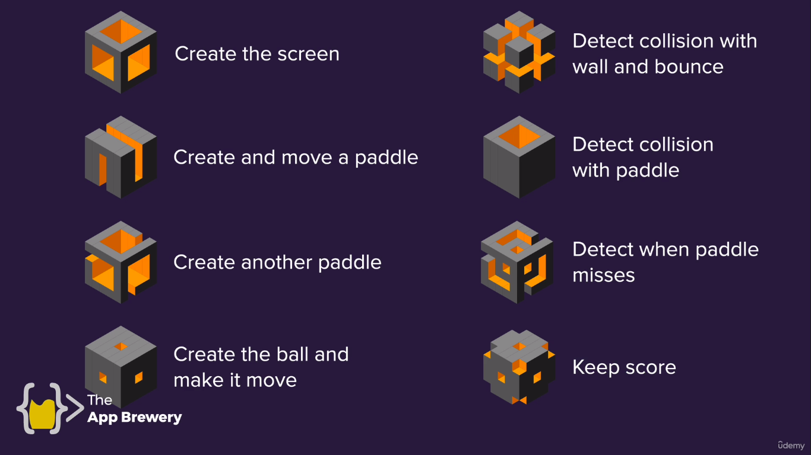

# Pong

Famoso juego de arcade creado por Allan Alcorn.

Información del juego haciendo [click aquí](https://en.wikipedia.org/wiki/Pong).

Este juego corresponde al día 22 del curso **100 Days of Code**.

El juego se desarrolló siguiendo los siguientes pasos:

[Documentación de Turtle Graphics](https://docs.python.org/3/library/turtle.html#module-turtle)